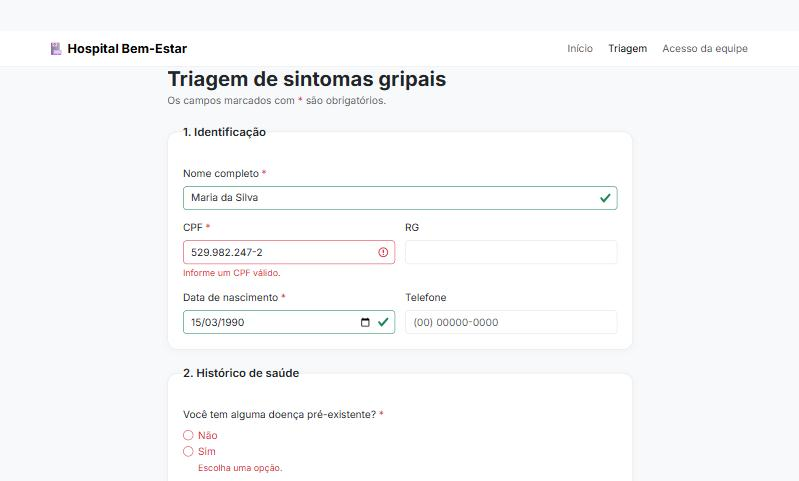

# 🏥 Triagem de Sintomas Gripais

Site de um hospital fictício com **triagem online de sintomas gripais**: o paciente preenche identificação, histórico de saúde e sintomas, e recebe um resumo para apresentar na recepção. Feito com **HTML, Bootstrap 5 e JavaScript**.

<p align="center">
  
</p>

## ✨ Funcionalidades

- 🏠 **Página inicial** explicando a triagem em 3 passos
- 📝 **Formulário de triagem** dividido em identificação, histórico de saúde e sintomas
- ✅ **Validação de verdade:** CPF conferido pelos dígitos verificadores, data de nascimento que não pode ser no futuro e pelo menos um sintoma marcado
- 🔢 **Máscaras** de CPF e telefone enquanto a pessoa digita
- ❓ **Campo condicional:** o campo "Quais doenças?" só aparece e só é obrigatório quando a resposta é "Sim"
- 🚨 **Alerta de gravidade** quando o paciente marca falta de ar
- 📋 **Resumo final** com idade calculada e os sintomas informados
- 🔐 **Tela de acesso da equipe** (protótipo de interface, sem servidor)
- 📱 Layout responsivo com menu recolhível no celular

<p align="center">
  
</p>

## 🧠 Decisões técnicas

- **Validação separada da interface:** as regras ficam em [`js/validacao.js`](js/validacao.js) como funções puras, testadas com o test runner do Node.js. O [`js/triagem.js`](js/triagem.js) só liga essas regras à página.
- **Validação nativa do navegador + Bootstrap:** os campos usam `required`, `minlength` e `setCustomValidity`, e o Bootstrap mostra as mensagens com `was-validated`. Não precisei de biblioteca extra.
- **Privacidade:** nenhum dado sai do navegador. O formulário não é enviado para servidor nenhum; o resumo é montado na própria página.
- **Acessibilidade:** `fieldset`/`legend` em cada etapa, rótulos ligados aos campos, foco levado ao primeiro erro e ao resumo, alerta com `role="alert"`.

## 🛠️ Tecnologias

HTML · CSS · Bootstrap 5 · JavaScript · Node.js Test Runner

## 📁 Estrutura

```
index.html              → página inicial
triagem.html            → formulário de triagem
login.html              → acesso da equipe (protótipo)
css/style.css           → tema e ajustes sobre o Bootstrap
js/validacao.js         → regras de validação e máscaras
js/triagem.js           → comportamento do formulário
js/validacao.test.js    → testes das regras
img/hospital.jpg        → ilustração da página inicial
```

## 🚀 Como executar

Baixe o repositório e abra o `index.html` no navegador.

Para rodar os testes (precisa do [Node.js](https://nodejs.org/) 18 ou mais recente):

```bash
node --test
```

> ⚠️ Projeto de estudo. O hospital é fictício e a triagem não substitui avaliação médica.
